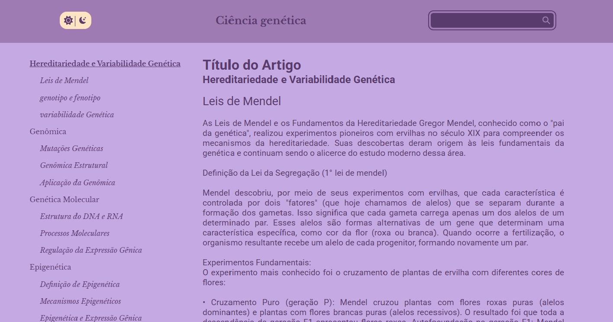
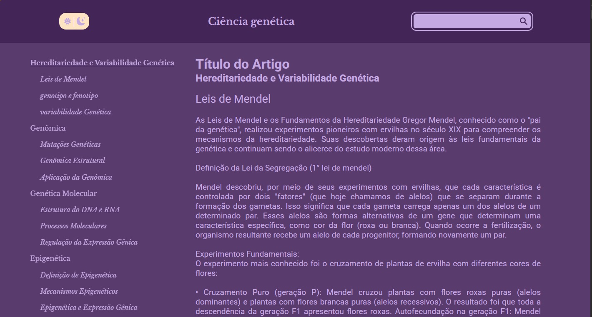
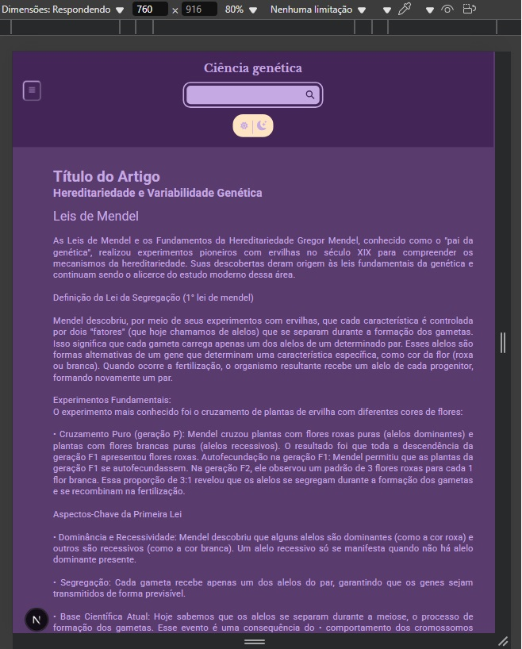
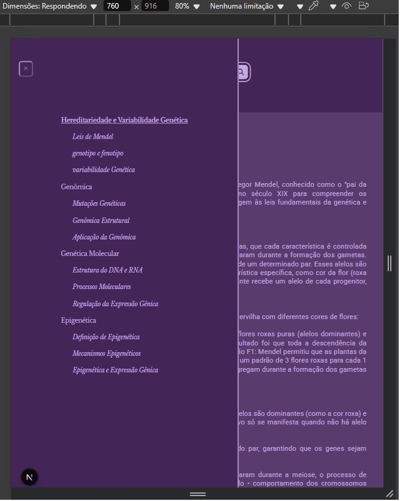

# Nome do Projeto
Genética


> Um website criado para elucidar e explanar principais temas da área da génetica, de forma lúdica e agradável.

## Sumário

- [Sobre o Projeto](#sobre-o-projeto)
- [Começando](#começando)
- [Pré-requisitos](#pré-requisitos)
- [Instalação](#instalação)
- [Uso](#uso)
- [Exemplos de Código](#exemplos-de-código)
- [Funcionalidades](#funcionalidades)
- [Tecnologias Utilizadas](#tecnologias-utilizadas)
- [Contribuição](#contribuição)
- [Licença](#licença)
- [Autor](#autor)
- [Agradecimentos](#agradecimentos)

## Sobre o projeto <a name="sobre-o-projeto"></a>

Este projeto foi desenvolvido utilizando linguagem typescript e framework Next.JS. Esta pronta para uso e segue as melhores práticas de desenvolvimento.

## Começando <a name="começando"></a>

### Pré-requisitos <a name="pre-requisitos"></a>

Antes de iniciar , certifique-se acerca da instalação:
- Node.js v22.13.0 (versão utilizada no desenvolvimento do projeto → abril de 2025 )
- npm ou yarn

### Instalação <a name="instalação"></a>

Clone o repositório e instale as dependências:

```bash
git clone https://github.com/Talisson-matos/genetica.git
cd seuprojeto
npm install 
```

## Uso <a name="uso"></a>

### Executar o projeto

***Para iniciar o projeto, basta rodar o seguinte comando:***

```bash
npm start
```
***Se estiver em ambiente de desenvolvimento, você pode rodar:***

```bash
npm run dev
```

## Exemplo de código <a name="exemplos-de-código"></a>

1️⃣ Exemplo de conexão com o banco de dados

Se seu projeto usa MongoDB, você pode incluir um exemplo de como conectar ao banco:

typescript
import { MongoClient } from "mongodb";

const uri = process.env.MONGODB_URI || "mongodb://localhost:27017/meubanco";
const client = new MongoClient(uri);

async function connectDB() {
    try {
        await client.connect();
        console.log("✅ Conectado ao banco de dados!");
    } catch (error) {
        console.error("Erro ao conectar ao banco:", error);
    }
}

connectDB();

2️⃣ Exemplo de uma API REST simples

Se seu projeto tem uma API, você pode incluir um exemplo de requisição:

typescript
import type { NextApiRequest, NextApiResponse } from "next";

export default function handler(req: NextApiRequest, res: NextApiResponse) {
    res.status(200).json({ mensagem: "🚀 API funcionando!" });
}

3️⃣ Exemplo de uso de uma função utilitária

Caso seu projeto tenha funções de manipulação de dados, um exemplo seria:

typescript
export function formatarData(data: Date): string {
    return data.toISOString().split("T")[0]; // Retorna a data no formato YYYY-MM-DD
}

console.log(formatarData(new Date())); // Exemplo de saída: "2025-04-15"

4️⃣ Exemplo de uso da API

Se seu projeto disponibiliza endpoints, mostre como chamá-los:

typescript
fetch("https://api.exemplo.com/dados")
    .then(response => response.json())
    .then(data => console.log("📊 Dados recebidos:", data))
    .catch(error => console.error("❌ Erro ao buscar dados:", error))

## Layout & Funcionalidades <a name="fucionalidades"></a>

### Tema claro e escuro

• Contém alternância de temas claro e escuro;

• Contém input para pesquisa de temas de interesse do usuário;

• Contém aside interativo com sistema de âncoras para 
navegação e indicação aonde o usuário esta na página.

**Tema Claro**



**Tema Escuro**



### Layout responsivo

• Layout responsivo respondendo de mobile a desktops.






### Video ilustrativo

**Para mais interesses você pode baixar por aqui este vídeo ilustrativo da aplicação ou então acessá-lo pelo You Tube no link abaixo**


[](https://youtu.be/UgtELYwMR7w)

## Tecnologias utilizadas <a name="tecnologias-utilizadas"></a>

- **Frontend:** Interface do usuário construída com React/Next.JS/Typescript.

- **Backend:** API REST desenvolvida em Next.js API Routes.

- **Banco de Dados:** MongoDB utilizado para armazenamento de dados.

##  Contribuição

Ficamos felizes por querer contribuir! Siga os passos abaixo para participar do projeto.

###  Como contribuir <a name="contribuição"></a>

- Correções de bugs são sempre bem-vindas!

- Sinta-se livre para sugerir e implementar novas 
funcionalidades.

- Melhorias na documentação ajudam muito – qualquer atualização é válida.

###  Passos para contribuir
1. **Fork** este repositório e clone para sua máquina local → https://github.com/Talisson-matos/genetica.git .

2. Crie uma nova **branch** para suas alterações: `git checkout -b minha-contribuicao`.

3. Faça as **modificações** necessárias e commit suas alterações: `git commit -m "Descrição breve da alteração"`.

4. Faça push da branch: `git push origin minha-contribuicao`.

5. Abra um **Pull Request** e aguarde a revisão da equipe.

###  Código de Conduta

Pedimos que todos os colaboradores respeitem nosso [📜 Código de Conduta](CODE_OF_CONDUCT.md)
. Queremos um ambiente inclusivo e colaborativo!

##  Licença <a name="licença"></a>

Genética License

Copyright (c) 2025 Genética

A permissão é concedida, gratuitamente, a qualquer pessoa que obtenha uma cópia
deste software e arquivos de documentação associados (o "Software"), para lidar com
no Software sem restrição, incluindo, sem limitação, os direitos
usar, copiar, modificar, mesclar, publicar, distribuir, sublicenciar e/ou vender
cópias do Software e permitir que as pessoas a quem o Software seja
fornecido para o efeito.

## Autor <a name="autor"></a>

**Nome**: Talisson Moreira Matos.

### 📧 Contato

Caso tenha dúvidas, entre em contato conosco por e-mail : talissonmatos23@gmai.com.


## Agradecimentos <a name="agradecimentos"></a>

Nosso muito obrigado a todos que contribuíram e apoiaram este projeto! Sua ajuda foi fundamental.

**&copy 2025 Sempre a procura do desenvolvimento e melhorias.**


